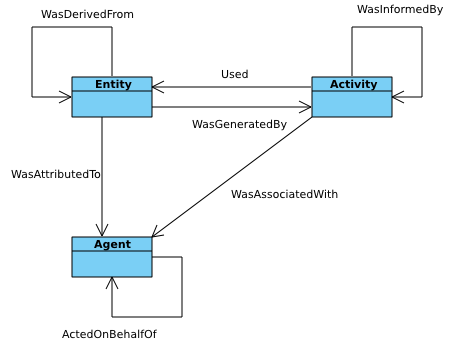

Code Design
===========

This section of the documentation describes the data structures and
organisation of the code. It is primarily intended for developers.

Data Containers
---------------

Diagnostics and the results of calculations are stored using the
:py:class:`xarray.DataArray` and :py:class:`xarray.Dataset`
classes. This stores multidimensional data with labelled dimensions,
coordinates along each dimension, and associated metadata. Standard
mathematical operations are built into these objects. Additional
bespoke functionality is provided using meta-data and `"custom
accessors"
<http://xarray.pydata.org/en/stable/internals.html#extending-xarray>`_,
as described in the xarray documentation.

Each observed quantity will be stored in its own
:py:class:`xarray.DataArray` object. Results describing the same
species of in the plasma can be grouped together by the user into a
single :py:class:`xarray.Dataset`. This will allow the data to be
passed to a calculation as one argument, rather than several and it is
anticipated that most calculations will be designed to work this way.

Metadata
~~~~~~~~

The following metadata should be attached to
:py:class:`xarray.DataArray` objects:

datatype : ``(str, str)``
    Information on the type of data stored in this
    :py:class:`xarray.DataArray` object. See :ref:`Data Value Type
    System`.

provenance : :py:class:`prov.model.ProvEntity`
    Information on the process which generated this data, including
    the equilibrium used, if set. See :ref:`Provenance Tracking`.

partial_provenance : :py:class:`prov.model.ProvEntity`
    Information on the process which generated this data, not
    including the equilibrium used. See :ref:`Provenance Tracking`.

transform : :py:class:`indica.converters.CoordinateTransform`
    An object describing the coordinate system of this data, with
    methods to map to other coordinate systems. See :ref:`Coordinate
    Systems and Transforms`

error (optional) : :py:class:`xarray.DataArray`
    Uncertainty in the value (will not contain any metadata of its own).

dropped (optional) : :py:class:`xarray.DataArray`
    Any channels which were dropped from the main data.

In addition, where :py:class:`xarray.Dataset` objects are used, they
will have the following metadata:

provenance  : :py:class:`prov.model.ProvEntity`
    A provenance ``collection`` indicating the contents of this
    Dataset. See :ref:`Data Value Type System`.

datatype : ``(str, dict)``
    Information on the type of data stored in this
    :py:class:`xarray.Dataset` object. See :ref:`Data Value Type
    System`.

Accessing Equilibrium Data
--------------------------

Key to analysing any fusion reactor data is knowing the equilibrium
state of the plasma. This is done using equilibrium
calculations. Multiple models are available for this and it should be
easy to swap one for another in the calculation. The same interface
should be used for results from all fusion reactors (as is the case
elsewhere in the code).

The equilibrium data which is of interest is the total magnetic field
strength, the location of various flux surface (poloidal, toroidal,
and potentially others), the minor radius, the volume enclosed by a
given flux surface, and the minimum flux surface for a
line-of-sight. An :py:class:`~indica.equilibrium.Equilibrium` class is defined with
methods to obtain these values. Rather than try to anticipate every type of flux
surface which might be needed, any method which takes or returns a
flux surface has an argument ``kind`` which accepts a string
specifying which one is desired (``"toroidal"``, by default). There is
also a method to convert between different flux surface types. This
will allow support to be added for additional kinds of fluxes without
needing to change the interface.

Unfortunately, equilibrium results are not always entirely accurate
and may need to be adjusted. A multiplier for the magnetic field
strength should be provided in the constructor for the equilibrium
object. Additionally, the location of the flux surfaces will often be
slightly offset along the major axis from the "real" ones. Therefore,
a ``calibrate`` method is provided. This estimates (to the nearest
half centimetre) the offset in R needed for the electron temperature
at the last closed flux surface to be about 100eV. It provides a plot
of the optimal R-shift at different times, with the average value also
draw. This average value is used to reposition the flux surfaces and a
second plot is produced with electron temperature against normalised
flux. The user can choose to accept this offset or to specify a custom
value. If the latter, these plots will be recreated with the new
R-shift and the user will again be asked whether or not to accept
it. (This is the default behaviour; it is also possible for the user
to provide a handler method with custom functionality, such as
determining the result automatically or to integrate the selection
interface more tightly with the GUI.)

:py:class:`~indica.equilibrium.Equilibrium` objects are instantiated using a
:py:class:`xarray.Dataset` of equilibrium data obtained using a
:py:class:`~indica.readers.DataReader` object (see :ref:`Data IO`). The equilibrium
class can be represented by the following UML.

.. uml::

   class Equilibrium {
   + tstart: float
   + tend: float
   + provenance: ProvEntity
   - _session: Session

   + __init__(equilibrium_data: Dataset)
   + calibrate(T_e: DataArray, selector: Callable)
   + Btot(R: arraylike, z: arraylike, t: arraylike): (arraylike, arraylike)
   + enclosed_volume(rho: array_like, t: array_like, kind: str):
     \t\t\t\t\t\t\t(arraylike, arraylike)
   + minor_radius(rho: arraylike, theta: arraylike, t: arraylike,
     \t\t\tkind: str): (arraylike, arraylike)
   + flux_coords(R: arraylike, z: arraylike, t: arraylike, kind: str):
     \t\t\t\t\t\t\t(arraylike, arraylike, arraylike)
   + spatial_coords(rho: arraylike, theta: arraylike, t: arraylike,
     \t\t\tkind: str): (arraylike, arraylike, arraylike)
   + convert_flux_coords(rho: arraylike, theta: arraylike, t: arraylike,
     \t\t\tkind: str): (arraylike, arraylike, arraylike)
   + R_hfs(rho: arraylike, t: arraylike, kind: str): (arraylike, arraylike)
   + R_lfs(rho: arraylike, t: arraylike, kind: str): (arraylike, arraylike)
   }

Coordinate Systems and Transforms
---------------------------------

Each diagnostic which is used for calculations is stored on a
different coordinate system and/or grid. One of the key challenges is
thus to make it easy to convert between these coordinate systems. This
is further complicated by the fact that many of the coordinate systems
are based on what (time-dependent) equilibrium state was calculated
for the plasma. Transforms between coordinate systems must therefore
be agnostic as to which equilibrium results are used.

When operations are performed on :py:class:`xarray.DataArray` objects,
they are :ref:`automatically aligned <math automatic alignment>`
("alignment" meaning that ticks on their respective axes have the same
locations). Any indices which do not match are discarded; the result
consists only of the union of the two sets of coordinates. When
operating on datasets where some or all dimensions have different
names, it automatically performs :ref:`compute.broadcasting`. However,
note that this would not be physically correct if the coordinates are
not linearly independent.

There is also built-in support for :ref:`interpolating onto a new
coordinate system <interp>`. This
can be either for different grid-spacing on the same axes or for
another set of axes entirely. The latter can be slightly cumbersome to
do and requires some additional information about how coordinates map,
so we will likely want to provide convenience methods for that
purpose.

In order to perform these sorts of conversions, I means is necessary
to map from one coordinate system to another. An arbitrary number of
potential coordinate systems could be used and being able to map
between each of them would require :math:`O(n^2)` different
functions. This can be reduced to :math:`O(n)` if instead we choose a
go-between coordinate system to which all the others can be
converted. A sensible choice for this would be :math:`R, z`, as these
axes are orthogonal, the coordinates remain constant over time, and
libraries to retrieve equilibrium data typically work in these
coordinates.

A :py:class:`~indica.converters.CoordinateTransform` class is defined to handle
this process. This is an abstract class which will have a different
subclass for each type of coordinate system. It has two abstract
methods (both private), for converting coordinates to and from
R-z. These get wrapped by public (non-abstract) methods which provide
default argument values and cache the result for these
defaults. A non-abstract ``convert_to`` method takes
another coordinate system as an argument and will map coordinates
onto it. Finally, the ``distance`` method can provide the spatial
distance between grid-points along a given axis and first grid-point
on that axis.

In addition to doing conversions via R-z coordinates, subclasses of
:py:class:`~indica.converters.CoordinateTransform` may define additional
methods to map directly between coordinate systems. This would be
useful if there is a more efficient way to do the conversion without
going through R-z, if that transformation is expected to be
particularly frequently used, or if that transformation would need to
be done as a step in converting to R-z coordinates.

The :py:class:`~indica.converters.CoordinateTransform` class is agnostic
to the equilibrium data and can be instantiated without any knowledge
of it. However, many subclasses will require equilibrium information
to perform the needed calculations. This can be set using the
:py:meth:`~indica.converters.CoordinateTransform.set_equilibrium` method
at any time after instantiation. Calling this method multiple times
with the same equilibrium object will have no affect. Calling with a
different equilibrium object will cause an error unless specifying the
argument ``force=True``.

.. uml::

   class CoordinateTransform {
   + set_equilibrium(equilibrium: Equilibrium, force: bool)
   + convert_to(other: CoordinateTransform, x1: arraylike, x2: arraylike,
                \t\tt: arraylike): (arraylike, arraylike, arraylike)
   + convert_to_Rz(x1: arraylike, x2: arraylike, t: arraylike):
     \t\t\t\t\t\t(arraylike, arraylike, arraylike)
   + convert_from_Rz(x1: arraylike, x2: arraylike, t: arraylike):
     \t\t\t\t\t\t(arraylike, arraylike, arraylike)
   + distance(direction: int, x1: arraylike, x2: arraylike,
              \t\tt: arraylike): (arraylike, arraylike)
   - {abstract} _convert_to_Rz(x1: arraylike, x2: arraylike, t: arraylike):
     \t\t\t\t\t\t(arraylike, arraylike, arraylike)
   - {abstract} _convert_from_Rz(x1: arraylike, x2: arraylike, t: arraylike):
     \t\t\t\t\t\t(arraylike, arraylike, arraylike)
   - encode(): str
   - {static} decode(input: str): CoordinateTransform
   }

Methods to :py:meth:`~indica.converters.CoordinateTransform.encode` and
:py:meth:`~indica.converters.CoordinateTransform.decode` a transform
to/from JSON will be provided. This will work by encoding the
arguments used to instantiate a transform object, allowing it to be
recreated upon decoding. Note that this means the equilibrium will
still need to be set again manually. Most of this functionality should
be implemented from the base class and those writing subclasses
shouldn't need to do more than call a method at instantiation or use a
decorator (details TBC).

Each DataArray will have a ``transform`` attribute which is one of
these objects. To save on memory and computation, different data from the same
instrument/diagnostic will share a single transform object. This
should not normally be of any concern for the user, unless they area
attempting to use multiple sets of equilibrium data at once.

Not that the methods on
:py:class:`~indica.converters.CoordinateTransform` make use of `array
broadcasting
<https://numpy.org/doc/stable/user/basics.broadcasting.html>`_ to
create a grid of values. This means that if all arguments are 1-D
arrays (``x1``, ``x2``, ``t``) then the results will be 1-D arrays
giving the transformed coordinates at ``(x1[0], x2[0], t[0])``, ``(x1[1],
x2[1], t[1])``, etc. If you want your results to be on a
multidimensional grid you will need to pass in multidimensional grids
as arguments. However, broadcasting will still work properly even if
only one dimension on the input grids have a length greater than 1.

::

   # This will return a set of 1-D arrays
   converter1.convert_to(converter2, [0, 1, 2], [0, -1, -2], t=5.0)
   # This will return a set of 2-D arrays
   converter1.convert_to(converter2, [[0, 1, 2],
                                      [0, 1, 2],
                                      [0, 1, 2]],
                                     [[ 0,  0,  0],
				      [-1, -1, -1],
                                      [-2, -2, -2]], t=5.0)
   # This will return the same 2-D arrays as the previous command
   converter1.convert_to(converter2, [[0, 1, 2]], [[0], [-1], [-2]],
                         t=5.0)

When two :py:class:`xarray.DataArray` objects use the same coordinate
system with only different grid spacing, the built in
:py:meth:`~xarray.DataArray.interp_like` method already provides a
convenient interface to interpolate one onto the same locations as the
other. For converting to different coordinate systems, I would suggest
extending :py:class:`xarray.DataArray` with a `"custom accessor"
<http://xarray.pydata.org/en/stable/internals.html#extending-xarray>`_
that has a method ``remap_like()``, which would provide the same
behaviour (and simply delegate to ``interp_like()`` if the same
coordinate system is used). More details to follow.

Custom accessors appear like attributes on
:py:class:`xarray.DataArray`, with their own set of methods. This
allows xarray extensions to be "namespaced" (i.e., common
functionality gets grouped into the same accessor). The
use is as follows::

  # array1 and array2 are on different coordinate systems.

  # Broadcasting creates a 4D array; probably not what you want
  array3 = array1 + array2

  # Same coordinate system as array1
  array4 = array1 + array2.indica.remap_like(array1)

  # Same coordinate system as array2
  array5 = array1.indica.remap_like(array2) + array2

Anyone who imports this library will be able to use the accessor with
xarrays in their own code.

Data IO
-------

There is some common functionality for all reading and writing
operations which will be performed. This involves authenticating
users and opening/closing the IO stream. For convenience, methods
should be provided to make the latter possible through a context
manager. This functionality is placed in a common base class
:py:class:`~indica.abstractio.BaseIO`, leaving methods abstract where
necessary.

.. uml::

   abstract class BaseIO {
   + __enter__(): DataWriter
   + __exit__(exc_type, exc_value, exc_traceback): bool
   + authenticate(name: str, password: str): bool
   + {abstract} close()
   .. «property» ..
   + {abstract} requires_authentication(): bool
   }

Input
~~~~~

Reading data is done using a standard interface,
:py:class:`~indica.readers.DataReader`. A different subclass is
defined for each data source/format. These return collections of
:py:class:`xarray.DataArray` objects with all the necessary metadata.

.. uml::

   abstract class DataReader {
   + DIAGNOSTIC_QUANTITIES: dict
   __
   + get_thomson_scattering(uid: str, instrument: str, revision: int,
               \t\t\t\tquantities: Set[str]): Dict[str, DataArray]
   - {abstract} _get_thomson_scattering(uid: str, instrument: str, revision: int,
               \t\t\t\tquantities: Set[str]): Dict[str, Any]
   + get_charge_exchange(uid: str, instrument: str, revision: int,
               \t\t\t\tquantities: Set[str]): Dict[str, DataArray]
   - {abstract} _get_thomson_scattering(uid: str, instrument: str, revision: int,
               \t\t\t\tquantities: Set[str]): Dict[str, Any]
     etc.
   }

   class PPFReader {
   + DIAGNOSTIC_QUANTITIES: dict
   - _client: SALClient
   __
   + __init__(pulse: int, tstart: float, tend: float, server: str)
   + authenticate(name: str, password: str): bool
   - _get_thomson_scattering(uid: str, instrument: str, revision: int,
                  \t\t\t\tquantities: Set[str]): Dict[str, Any]
   - _get_thomson_scattering(uid: str, instrument: str, revision: int,
                  \t\t\t\tquantities: Set[str]): Dict[str, Any]
     etc.
   + close()
   .. «property» ..
   + {abstract} requires_authentication(): bool
   }

   BaseIO <|-- DataReader
   DataReader <|-- PPFReader

Here we see that reader classes contain public methods for getting
data for each type of diagnostic. It also provides methods for
authentication and closing a database connection. Each reader should
feature a dictionary called ``DIAGNOSTIC_QUANTITIES``. This is a
nested structure of dictionaries indicating which combinations of
diagnostics, UIDs, instruments/DDAs, and measured quantities are
available, as well as the :ref:`data type of each one <Data Value Type
System>`.

The methods for getting diagnostic data (e.g.,
:py:meth:`~indica.readers.DataReader.get_thomson_scattering`) method is
implemented in the parent class and provides basic functionality for
assembling raw NumPy arrays into :py:class:`xarray.DataArray` objects,
with appropriate metadata. The actual process of getting these arrays
data is delegated to the abstract private methods (in this case,
``_get_thomson_scattering``), which are implementation
dependent. Implementations are free to define additional private
methods if necessary. The form of the constructor for each reader
class is not defined, as this is likely to vary widely.

In addition to reading in diagnostics, it is necessary to load ADAS
atomic data. Fortunately, this is much more straightforward. A simple
abstract :py:class:`~indica.readers.ADASReader` class is defined with a
:py:meth:`~indica.readers.ADASReader.get` method, taking a filename as
an argument. Each supported ADAS format will have a subclass which
implements a ``_get`` method. It is this method which does the actual
parsing of the file.  When instantiating these objects the user can
specify the directory which should be used when evaluating relative
paths. By default this will be an installed location containing ADAS
files distributed with the code, but this may be overridden. The
``get`` method returns an :py:class:`xarray.Dataset`, each member of
which is data for a different charge state. The coordinates of these
data are density and temperature of the element. All of the usual
metadata will be available except for ``transform``, which is not
meaningful in this case.

.. uml::

   abstract class ADASReader {
   + path: str

   + __init__(path: str)
   + get(filename: str): Dataset
   - {abstract} _get(filename: str): Tuple[Dict[str, ndarray], ArrayType]
   + close()
   .. «property» ..
   + requires_authentication(): bool
   }

   class ADF11Reader {
   - _get(filename: str): Tuple[Dict[str, ndarray], ArrayType]
   }

   BaseIO <|-- ADASReader
   ADASReader <|-- ADF11Reader

Output
~~~~~~

A similar approach of defining an abstract base class
(:py:class:`indica.writers.DataWriter`) is used for writing out data to
different formats.

.. uml::

   abstract class DataWriter {
   + write(uid: str, name: str, *args: Union[DataArray, Dataset])
   - {abstract} _write(uid: str, name: str, data: Dataset, equilibria: Dict[str, Equilibrium], prov: ProvDocument)
   }

   class NetCDFWriter {
   + __init__(filename: str)
   + _write(uid: str, name: str, data: Dataset, equilibria: Dict[str, Equilibrium], prov: ProvDocument)
   + close()
   .. «property» ..
   + requires_authentication(): bool
   }

   BaseIO <|-- DataWriter
   DataWriter <|-- NetCDFWriter

In derived class in this example writes to NetCDF files, which is a
particularly easy task as there is already close integration between
xarray and NetCDF. Other derived classes will be defined for each
database system which the software is able to read from.

This is a simpler design than that used for reading data. This is
because reading data requires dealing with the particularities of how
each diagnostic is stored data in the database and reorganising that
into a consistent format. When writing we can rely all diagnostics
being represented in essentially the same way in memory and thus only
need to convert it into a writeable format once, in the
:py:meth:`indica.writers.DataWriter.write` method. The only task
remaining is the simple one of writing to disk or a database in the
private ``_write`` method.

To reformat data to be more amenable to writing, the following will
occur. All data will be placed in a new :py:class:`xarray.Dataset`
containing all data, with attributes reformated as necessary:

- Uncertainty will be made a member of the dataset, with the name
  ``VARIABLE_uncertainty``, where ``VARIABLE`` is the name of the
  variable it is associated with.
- Dropped data will be merged into the main data and the attribute will
  be replaced with a list of the indices of the dropped channels and
  ``dropped_dim``, the name of the dimension these indices are for.
- The coordinate transform will be replaced with a JSON serialisation,
  from which it can be recreated. These serialisations will be stored
  in a dictionary attribute for the Dataset as a whole, with each
  DataArray holding the key for its corresponding transform.
- The PROV attributes will be replaced by the ID for that entity. The
  complete PROV data for the session will be passed to low-level
  writing routines as a separate argument.
- Datatypes will be serialised as JSON
- All variables will have an ``equilibrium`` attribute, which provides an
  identifier for the equilibrium data (passed to the low-level writer
  in a dictionary).

PROV and equilibrium data should be written elsewhere in the output
file/database, with attributes used to associate variables with it. If
desired, a similar approach could be taken when it comes to writing
coordinate transform data, as many variables are likely to share the
same transform.

Data Value Type System
----------------------

When performing physics operations, arguments have specific physical
meanings associated with them. The most obvious way this manifests
itself is in terms of what units are associated with a
number. However, you may have multiple distinct quantities with the
same units and an operation may require a specific one of those. It is
desirable to be able to detect mistake arising from using the wrong
quantity as quickly as possible. For this reason, operations on data
define what they expects that data to be and to check this.

Beyond catching errors when using this software as a library or
interactively at the command line, this technique will be valuable
when building a GUI interface. It will allow the GUI to limit the
choice of input for each operation to those variables which are
valid. This will simplify use and make it safer.

This system does not need to be very complicated. A type for the data
in an :py:class:`xarray.DataArray` consists of two labels. The first
indicates the **general type** of quantity (e.g., number density,
temperature, luminosity, etc.) and the second indicates the **specific
type** of species (type of ion, electrons, soft X-rays, etc.) which
this quantity describes. The second label is optional and its absence
indicates that the specific type is unknown (e.g., when describing
what quantities can be read-in) or there are no requirements (e.g.,
when describing arguments for a calculation). This is expressed as a
2-tuple, where the first element is a string and the second is either
a string or ``None``. See examples below::

    # Describes a generic number density of some particle
    ("number_density", None)
    # Describes number density of electrons
    ("number_density", "electrons")
    # Describes number density of primary impurity
    ("number_density", "tungston")

Type descriptions are a bit more complicated for
:py:class:`xarray.Dataset` objects. Recall that these objects are
groupings of data for a given species. Therefore, they are made up a
2-tuple where the first item is the specific type and the second is a
dictionary. This dictionary maps the names of the
:py:class:`xarray.DataArray` objects contained in the Dataset to the
general type that DataArray stores::

    # Describes data number density, temperature, and angular
    # frequency of Tungston
    ("tungston", {"n", "number_density",
                  "T": "temperature",
                  "omega": "angular_freq"})

Each operation on data contains information on the types of arguments
it expects to receive and return and has a method to confirm that
these expectations are met. An operation should always specify the
general datatype(s) and may choose to specify the specific datatype if
appropriate (otherwise leaving it as ``None``). Each
:py:class:`xarray.DataArray` and :py:class:`xarray.DataArray` contains
a type-tuples in its metadata, associated to the key ``"type"`` and
this always specifies both general and specific type(s).

In principal, this is all the infrastructure that would be needed for
the type system. However, it is useful to keep a global registry
of the types available. This helps to enforce consistent
labelling of types and gives the ability to check for type. It
is also used to store information on what each type corresponds
to and in what units it should be provided. This information is
useful documentation for users and can be integrated in a GUI
interface. This is be accomplished using dictionaries::

    GENERAL_DATATYPES = {"number_density": ("Number density of a particle", "m^-3"),
                         "temperature": ("Temperature of a species", "keV")}
    SPECIFIC_DATATYPES = {"electrons": "Electron gas in plasma",
                          "tungston": "Tungston ions in plasma"}

It is expected that many calculations will not specify a specific
datatype as they can in principle work with any kind of ion. The user
can try running the calculation with different combinations of
impurities and see which produces the most reasonable results.

Provenance Tracking
-------------------

In order to make research reproducible, it is valuable to know exactly
how a data set is generated. For this reason, the library contains a
mechanism for tracking data "provenance". Every time data is created,
either by being read in or by a calculation on other data, a record
should also be created describing how this was done.

There already exist standards and library for recording this sort of
information: W3C defines the `PROV standard
<https://www.w3.org/TR/2013/NOTE-prov-overview-20130430/>`_ and the
`PyProv <https://prov.readthedocs.io/en/latest/index.html>`_ library
exists to use it from within Python. In this model, there are the
following types of records:

Entity : :py:class:`prov.model.ProvEntity`
    Something you want to describe the provenance of, such as book,
    piece of artwork, scientific paper, web page, or book.
Activity : :py:class:`prov.model.ProvActivity`
    Something occurring over a period of time which acts on or with
    entities.
Agent : :py:class:`prov.model.ProvAgent`
    Something bearing responsibility for an activity occurring or an
    entity existing.

There are various sorts of relationships between these objects, with
the main ones summarised in the diagram below.

This software provides a class :py:class:`~indica.session.Session` which holds
the :py:class:`provenance document <prov.model.ProvDocument>` as well
as contains information about the user and version of the software. A
global session can be established using
:py:meth:`indica.session.Session.begin` or a context manager. Doing so
requires specifying information about the user, such as an email or
ORCiD ID. The library will then use this global session to record
information or, alternatively, you can provide your own instance when
constructing objects. The latter option allows greater flexibility
and, e.g., running two sessions in parallel.

What follows is a list of the sorts of PROV objects which will be
generated. Each of them should come with an unique identifier. Where
the data is read from some sort of database this could be the key for
the object. Otherwise it should be a hash generated from the metadata
of the object.

Calculations
~~~~~~~~~~~~
A calculation will be represented by an **Activity**. It will be
linked with the data entities it used to do the calculation, the user
or other agent to invoke it, and the Operator object which actually
performed it.

:py:class:`xarray.DataArray` objects
~~~~~~~~~~~~~~~~~~~~~~~~~~~~~~~~~~~~
Each data object will be represented by an **Entity**. This entity will
contain links with the user and piece of software (e.g., reader or
operator) to create it, the reading or calculation activity it was
produced by, and any entities which went into its creation. This first
entity will be stored as an attribute with the key
``partial_provenance``.

An additional **Entity** (a `collection
<https://www.w3.org/TR/2013/REC-prov-dm-20130430/#section-collections>`_)
will be stored as an attribute with key ``provenance``. This
collection will contain the ``partial_provenance`` entity and the
entity for the :py:class:`indica.equilibrium.Equilibrium` object used by
this data. Any change to the equilibrium object will result in a new
provenance entity.

:py:class:`xarray.Dataset` objects
~~~~~~~~~~~~~~~~~~~~~~~~~~~~~~~~~~
Datasets will also be represented by **Entities**, specifically a
`collection
<https://www.w3.org/TR/2013/REC-prov-dm-20130430/#section-collections>`_. The
DataArray objects making up the dataset will be indicated in PROV as members
of the collection.

:py:class:`~indica.readers.DataReader` objects
~~~~~~~~~~~~~~~~~~~~~~~~~~~~~~~~~~~~~~~~~~~
These objects are represented as both an **Entity** and an
**Agent**. The former is used to describe how it was instantiated
(e.g., the user that created it, what arguments were used) while the
latter can be used to indicate when it creates DataArray objects by
reading them in.

Dependency
~~~~~~~~~~
Third-party libraries which are depended on should be represented as
**Entitites** in the provenance data. Information should be provided
on which version was used.

:py:class:`~indica.equilibrium.Equilibrium` objects
~~~~~~~~~~~~~~~~~~~~~~~~~~~~~~~~~~~~~~~~~~~~~~~~
An Equilibrium object will be represented by an **Entity**. This
references the user (agent) to instantiate it, the constructor call
(activity) that did so, and the data (entities) used in its creation.

External data
~~~~~~~~~~~~~
External data (e.g., contained in files or remote databases)
should have a simple representation as an **Entity**. Sufficient
information should be provided to uniquely identify the record.

Operator objects
~~~~~~~~~~~~~~~~
Similar to reader objects, these are represented as both an **Entity**
and an **Agent**. Again, the former provides information on who
created the operator and what arguments were used. The latter
indicates the object's role in performing calculations.

Package
~~~~~~~
The overall library/impurities package is itself represented by an
**Entity**. This should contain information on the version or git
commit. It could also provide information on the authors who wrote it.

Reading data
~~~~~~~~~~~~
Reading data is an **Activity**. It is associated with a reader agent
and a user of the software. It uses external data entities.

:py:class:`~indica.session.Session` objects
~~~~~~~~~~~~~~~~~~~~~~~~~~~~~~~~~~~~~~~~
An **Activity** representing the current running instance of this
software. It uses the package and dependencies and is associated with
the user to launch it. It contains metadata on the computer being
used, the working directory, etc.

Users
~~~~~
The person using the software is represented as an **Agent**. Data
objects will be attributed to them. They are associated with the
session. Sometimes they will delegate authority to classes or
functions which are themselves agents. Sufficient metadata should be
provided to allow them to be contacted. Ideally they would have some
sort of unique identifier such as an ORCiD ID, but email is also
acceptable.

Operations on Data
------------------
In the previous two sections I referred to "operations" on data. These
should be seen as something distinct from standard mathematical
operators, etc. Rather, they should be thought of as representing some
discreet, physically meaningful calculation which one wishes to
perform on some data. They take physical quantities as arguments and
return one or more derived physical quantities as a result. It is
proposed that these be represented by callable objects of class
:py:class:`indica.operators.Operator`. A base class is provided,
containing some utility methods, which all operators inherit from. The
main purpose of these utility methods is to check that types of
arguments are correct and to assemble information on data
provenance. The class is represented by the following UML:

.. uml::

   class Operator {
   - _start_time: datetime
   - _input_provenance: list
   - _session: Session
   + agent: ProvAgent
   + entity: ProvEntity

   + __init__(self, sess: Session, **kwargs: Any)
   + {abstract} __call__(self, *args: Union[DataArray, Dataset]): Union[DataArray, Dataset]
   + create_provenance()
   + validate_arguments(*args: Union[DataArray, Dataset])
   + {static} recreate(provenance: ProvEntity): Operator
   }

   class ImplementedOperator {
   + {static} INPUT_TYPES: list
   + {static} RESULT_TYPES: list

   + __init__(self, ...)
   + __call__(self, ...): Union[DataArray, Dataset]
   }

   Operator <|-- ImplementedOperator

While performing the calculation they should not make reference to any
global data except for well-established physical constants, for
reasons of reproducibility and data provenance. If it would be too
cumbersome to pass all of the required data when calling the
operation, additional parameters can be provided at
instantiation-time; this is useful if the operation is expected to be
applied multiple times to different data but using some of the same
parameters.
